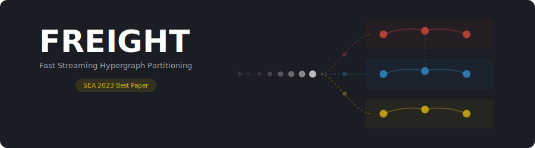

FREIGHT v1.0
[](https://opensource.org/licenses/MIT)
[](https://isocpp.org/)
[](https://cmake.org/)
[](https://github.com/KaHIP/FREIGHT/releases/latest)
[](https://github.com/KaHIP/FREIGHT)
[](https://github.com/KaHIP/FREIGHT)
[](https://github.com/KaHIP/FREIGHT/stargazers)
[](https://github.com/KaHIP/FREIGHT/issues)
[](https://github.com/KaHIP/FREIGHT/commits)
[](https://arxiv.org/abs/2302.06259)
[](https://drops.dagstuhl.de/entities/document/10.4230/LIPIcs.SEA.2023.15)
[](https://www.uni-heidelberg.de)
=====

<p align="center">
  
</p>

**FREIGHT** (Fast stREamInG Hypergraph parTitioning) is a streaming algorithm for hypergraph partitioning based on the Fennel algorithm. Part of the [KaHIP](https://github.com/KaHIP) organization.

| | |
|:--|:--|
| **What it solves** | Partition hypergraphs and graphs too large to fit in memory, or when you need fast partitioning |
| **Objective** | Minimize cut-net or connectivity metric with balanced block sizes |
| **Key results** | Superior to all existing streaming algorithms and the in-memory algorithm HYPE; competitive with Hashing in speed |
| **Algorithm** | Fennel-based streaming with efficient data structures for linear time and memory |
| **Award** | **SEA 2023 Best Paper Award** |
| **Interfaces** | CLI |
| **Requires** | C++17 compiler, CMake 3.10+ |

## Quick Start

### Install via Homebrew

```bash
brew install KaHIP/kahip/freight
```

### Or build from source

```bash
git clone https://github.com/KaHIP/FREIGHT.git && cd FREIGHT
./compile.sh
```

### Run

```bash
# Partition a hypergraph into 8 blocks (connectivity metric)
freight_con myhypergraph.hgr --k=8

# Partition a hypergraph into 8 blocks (cut-net metric)
freight_cut myhypergraph.hgr --k=8

# Partition a graph (METIS format) into 8 blocks
freight_graphs mygraph.graph --k=8
```

When building from source, binaries are in `./deploy/` (use `./deploy/freight_con` etc.).

---

## Executables

FREIGHT builds three partitioners and a format converter:

| Binary | Input format | Metric | Description |
|:-------|:------------|:-------|:------------|
| `freight_con` | Net-list | Connectivity | Hypergraph partitioning optimizing connectivity |
| `freight_cut` | Net-list | Cut-net | Hypergraph partitioning optimizing cut-net |
| `freight_graphs` | METIS | Edge-cut | Graph partitioning (Fennel-based streaming) |
| `hmetis_to_freight` | hMETIS | -- | Convert hMETIS format to FREIGHT net-list format |

---

## Command Line Usage

```
./deploy/freight_con <hypergraph-file> [options]
./deploy/freight_cut <hypergraph-file> [options]
./deploy/freight_graphs <graph-file> [options]
```

| Option | Description | Default |
|:-------|:-----------|:--------|
| `--k=<int>` | Number of blocks to partition into | *required* |
| `--imbalance=<double>` | Allowed imbalance (e.g. 3 = 3%) | `3` |
| `--num_streams_passes=<int>` | Number of streaming passes (restreaming improves quality) | `1` |
| `--restream_vcycle` | Keep recursive bisections across restream passes | disabled |
| `--seed=<int>` | Random seed for the PRNG | `0` |
| `--ram_stream` | Stream from RAM instead of disk | disabled |
| `--output_filename=<string>` | Output file for the partition | `tmppartition<k>` |
| `--suppress_output` | Suppress console output | disabled |
| `--suppress_file_output` | Suppress writing partition to file | disabled |
| `--help` | Print all available options | |

For a full list of parameters, run any executable with `--help`.

---

## Input Formats

### Hypergraph format (net-list)

FREIGHT uses a **node-centric net-list format** for hypergraphs. Each line represents one node and lists which nets (hyperedges) it belongs to. This enables streaming: nodes are processed one at a time as lines are read, without loading the full hypergraph into memory.

> **Note:** This is different from the standard hMETIS format, which is net-centric (one line per hyperedge). Use `hmetis_to_freight` to convert, see [Converting from hMETIS](#converting-from-hmetis) below.

**Header line:**
```
n m [f]
```
- `n` = number of nodes, `m` = number of nets
- `f` = format flag (optional): `0` = unweighted, `1` = net weights, `10` = node weights, `11` = both

**Node lines (one per node):**
Each of the following `n` lines lists the nets that the node belongs to (**1-indexed**). With format flag `1` or `11`, each net ID is followed by its weight. With flag `10` or `11`, each line starts with the node weight.

**Example** (4 nodes, 3 nets, unweighted):
```
4 3
1 2
1 3
2
2 3
```

Node 1 belongs to nets 1 and 2, node 2 belongs to nets 1 and 3, node 3 belongs to net 2, node 4 belongs to nets 2 and 3.

For more details, see [code_for_hypergraphs/examples/](code_for_hypergraphs/examples/).

### Converting from hMETIS

The standard **hMETIS format** is net-centric: the header is `m n [f]` (nets first, nodes second) and each line lists the pins (nodes) of a hyperedge. FREIGHT includes a converter:

```bash
# Convert hMETIS format to FREIGHT net-list format
hmetis_to_freight input.hgr output.netl

# Then partition
freight_cut output.netl --k=8
```

The converter handles all weight combinations (unweighted, node weights, net weights, or both).

### Graph format (METIS)

FREIGHT uses the standard **METIS graph format** for graph partitioning. See the [KaHIP manual](https://github.com/KaHIP/KaHIP/raw/master/manual/kahip.pdf) for details.

**Example** (4 vertices, 5 edges, unweighted):
```
4 5
2 3
1 3 4
1 2 4
2 3
```

---

## Building from Source

### Requirements

- C++17 compiler (GCC 7+ or Clang 11+)
- CMake 3.10+

### Build all executables

From the repository root:
```bash
./compile.sh
```

Or using CMake directly:
```bash
cmake -B build -DCMAKE_BUILD_TYPE=Release
cmake --build build --parallel
```

Binaries are placed in `./build/` (CMake) or `./deploy/` (compile.sh).

You can also build each code base independently:
```bash
cd code_for_hypergraphs && ./compile.sh    # builds freight_cut, freight_con
cd code_for_graphs && ./compile.sh         # builds freight_graphs
```

---

## How It Works

FREIGHT processes hypergraph nodes in a streaming fashion, assigning each node to a block as it arrives:

1. **Streaming assignment**: Each node is assigned to the block that maximizes a Fennel-based objective function, balancing partition quality against block sizes.
2. **Efficient data structures**: Running time is linearly dependent on the pin-count; memory consumption is linearly dependent on the number of nets and blocks.
3. **No in-memory requirement**: The full hypergraph never needs to be in memory, enabling partitioning of arbitrarily large inputs.

The algorithm is superior to all existing streaming hypergraph partitioners and even the in-memory algorithm HYPE, on both cut-net and connectivity metrics.

---

## Repository Structure

| Directory | Description |
|:----------|:------------|
| [code_for_hypergraphs/](code_for_hypergraphs/) | FREIGHT for hypergraph partitioning (freight_cut, freight_con) |
| [code_for_graphs/](code_for_graphs/) | FREIGHT optimized for graph partitioning (freight_graphs) |
| [experimental_results/](experimental_results/) | Full experimental results from the paper |
| [misc/](misc/) | SEA 2023 presentation slides |

---

## Related Projects

| Project | Description |
|:--------|:------------|
| [KaHIP](https://github.com/KaHIP/KaHIP) | Karlsruhe High Quality Graph Partitioning (flagship framework) |
| [HeiStream](https://github.com/KaHIP/HeiStream) | Buffered streaming graph and edge partitioner |
| [KaHyPar](https://github.com/kahypar) | Karlsruhe Hypergraph Partitioning |

---

## Licence

FREIGHT is free software provided under the MIT License.
If you publish results using our algorithms, please acknowledge our work by citing our paper:

```
@InProceedings{EyubovFS23,
  author    = {Eyubov, Kamal and Fonseca Faraj, Marcelo and Schulz, Christian},
  title     = {{FREIGHT: Fast Streaming Hypergraph Partitioning}},
  booktitle = {21st International Symposium on Experimental Algorithms (SEA 2023)},
  pages     = {15:1--15:16},
  series    = {Leibniz International Proceedings in Informatics (LIPIcs)},
  volume    = {265},
  publisher = {Schloss Dagstuhl -- Leibniz-Zentrum f{\"u}r Informatik},
  year      = {2023},
  doi       = {10.4230/LIPIcs.SEA.2023.15}
}
```
